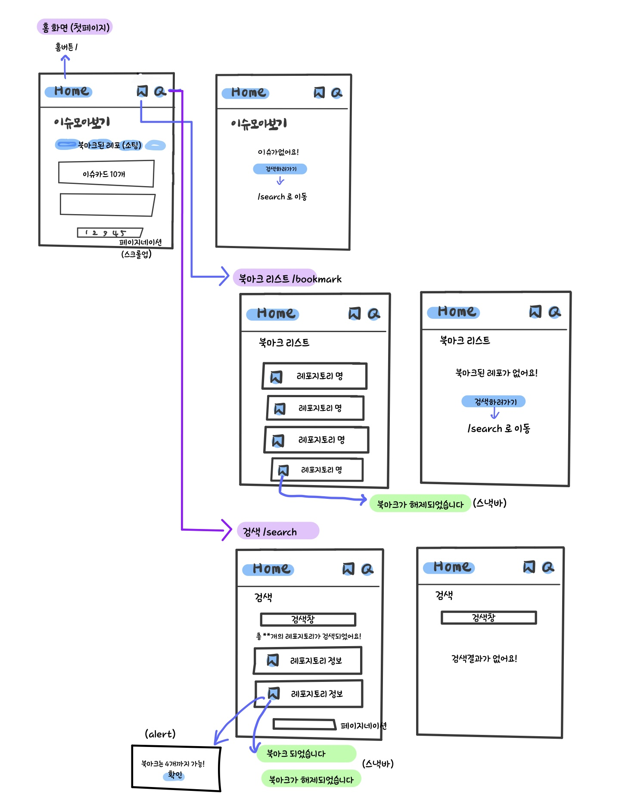

# GitHub Issue Trakcker

GitHub의 Public 레포지토리의 이슈를 모아볼 수 있습니다.

</br>

## 프로젝트 실행 방법

1. 프로젝트를 클론합니다.

```ts
// HTTPS
git clone https://github.com/devCecy/github-issue-tracker.git

// SSH
git clone git@github.com:devCecy/github-issue-tracker.git
```

2. node_modules을 설치합니다.

```ts
npm i
```

3. 프로젝트를 실행합니다.

```ts
// development
npm run start

// production
npm run serve
```

  </br>

## 와이어 프레임



</br>

## 주요 기능

- 북마크한 레포지토리의 이슈를 모아 볼 수 있습니다.
- 이슈 카드를 클릭하면 GitHub의 이슈 상세 페이지로 이동합니다.
- 북마크한 레포지토리의 리스트를 확인할 수 있습니다.
- 레포지토리를 검색할 수 있습니다.
- 레포지토리를 북마크하거나 해제할 수 있습니다.
- 레포지토리 북마크는 총 4개까지 가능합니다.

</br>

## 라이브러리

- `react-lazyload` : 이미지 지연로드 기능을 제공합니다.
- `timeago.js` : 현재를 기준으로 제공하는 시간이 얼마나 지났는지 변환하는 기능을 제공합니다. ex) 1 day ago
- `styled-components` : css in js 방식으로 스타일링 합니다.
- `@mui/material` / `@mui/icons-material` : React UI, Icon을 제공합니다.
- `recoil` : 전역상태를 관리합니다.
- `axios`: HTTP 클라이언트 라이브러리로 API 통신을 지원합니다.

</br>

## 참고 링크

- styled-components 반응형 처리 : https://blog.payhere.in/styled-components-with-responsive-web/

- 이슈카드 디자인 참고 : https://github.com/iuliuvisovan/github-issue-tracker

- 레포지토리의 Isuue 리스트 검색 : https://docs.github.com/en/rest/issues/issues?apiVersion=2022-11-28

- public 레포지토리 검색 : https://docs.github.com/en/search-github/searching-on-github/searching-for-repositories

- GiyHub Rest Api Pagination : https://docs.github.com/en/rest/guides/using-pagination-in-the-rest-api?apiVersion=2022-11-28

- GitHub 토큰 발행 : https://docs.github.com/en/authentication/keeping-your-account-and-data-secure/creating-a-personal-access-token
